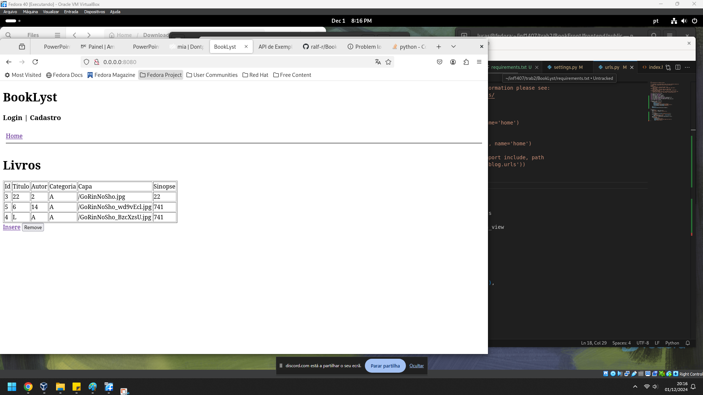
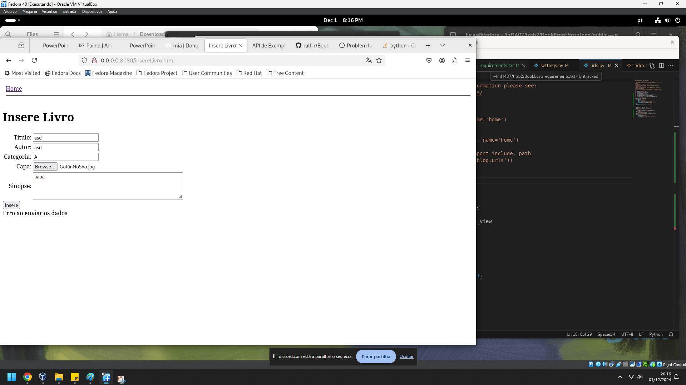
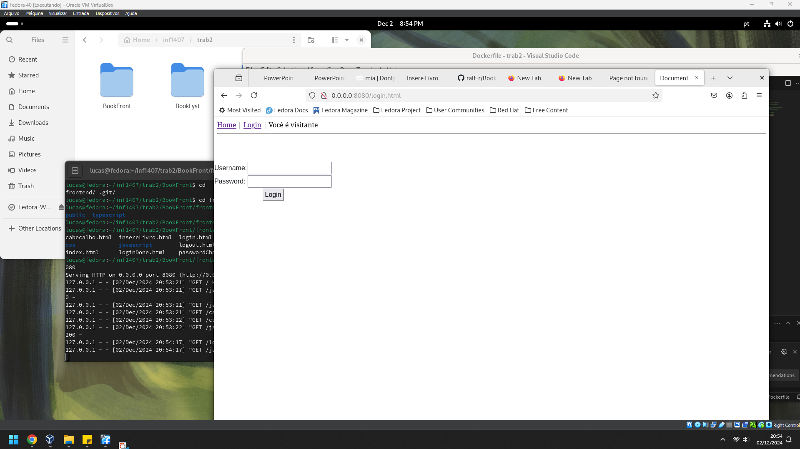

# BookFront
Repositório Frontend da aplicação Booklyst

backend desse front end -> (https://github.com/MirandaWopps/BookLyst/tree/novo)
Segue explicação do que foi feito. Ele está em imagem docker(https://hub.docker.com/repository/docker/miyaaaa/bookfront/general). As instruções para rodar ele estão no readme do backend. 

Existe a página home e da página home é possível logar,registrar, ver livros, acessar botão para inserir livros que leva para uma pagina com formulário para inserir livros.

Existe o arquivo "constantes.ts" que possui  o endereço do site quando a imagem docker estiver rodando. (0.0.0.0:8080)

Existem arquivos .ts  fazendo ações do CRUD(create, read, update, delete). 

Os arquivos HTML tem comentários no topo explicando sua existência.

  
